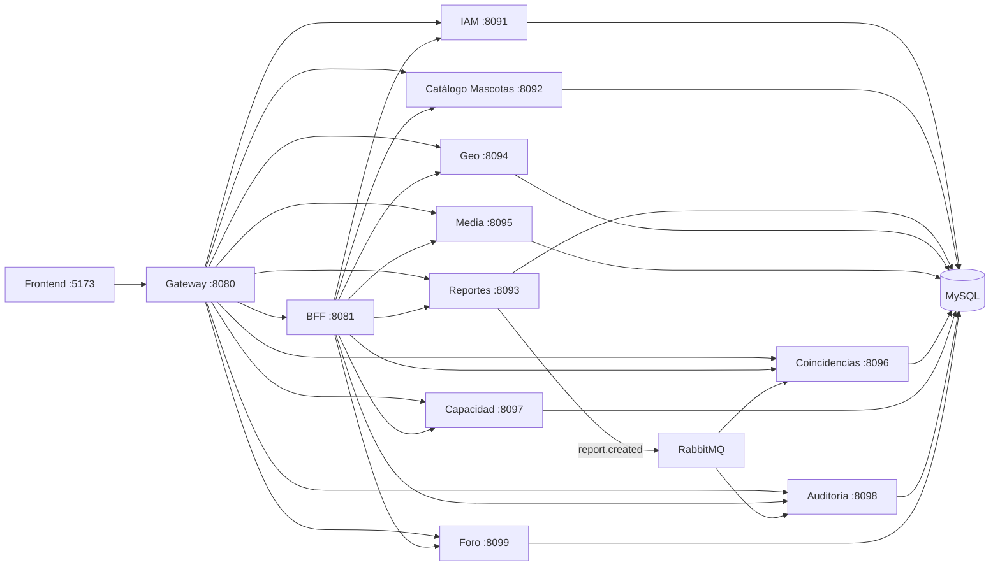

# Sanos y Salvos

Plataforma distribuida para **registro, reporte, geolocalización, coordinación comunitaria y coincidencia de mascotas** perdidas/encontradas.

El proyecto está implementado con arquitectura de **microservicios Spring Boot**, **API Gateway**, **BFF**, **RabbitMQ**, **MySQL** y frontend web modular.

---

## Tabla de contenidos

1. [Resumen ejecutivo](#resumen-ejecutivo)
2. [Inicio rápido](#inicio-rapido)
3. [Arquitectura del sistema](#arquitectura-del-sistema)
4. [Estructura del repositorio](#estructura-del-repositorio)
5. [Microservicios y responsabilidades](#microservicios-y-responsabilidades)
6. [Puertos, URLs y credenciales](#puertos-urls-y-credenciales)
7. [Infraestructura Docker](#infraestructura-docker)
8. [Mensajería RabbitMQ](#mensajeria-rabbitmq)
9. [Frontend](#frontend)
10. [API y Swagger](#api-y-swagger)
11. [Modelo de datos](#modelo-de-datos)
12. [Ejecución por escenarios](#ejecucion-por-escenarios)
13. [Pruebas y calidad](#pruebas-y-calidad)
14. [Scripts útiles](#scripts-utiles)
15. [Operación diaria](#operacion-diaria)
16. [Troubleshooting](#troubleshooting)
17. [Roadmap técnico sugerido](#roadmap-tecnico-sugerido)
18. [Documentación adicional](#documentacion-adicional)

---

## Resumen ejecutivo

- **Dominio:** mascotas perdidas/encontradas con trazabilidad y colaboración ciudadana.
- **Patrón de persistencia:** `database-per-service` (`db_iam`, `db_pets`, `db_reports`, etc.).
- **Entrada única:** `gateway` en `:8080`.
- **Agregación de datos para UI:** `bff` en `:8081`.
- **Asincronía académica:** evento `report.created` en RabbitMQ.
- **Frontend:** vistas separadas por rol (ciudadano/admin) con navegación lateral y mapa.

---

## Inicio rapido

### Requisitos

- Docker Desktop + Compose v2.
- Java 17 y Maven 3.9+ (solo para correr fuera de Docker).

### Levantar todo

```bash
docker compose up --build -d
```

En Windows también puedes usar:

- `encender-todo.bat`

### Verificación rápida

```bash
docker compose ps
docker compose logs -f gateway
```

---

## Arquitectura del sistema



### Principios aplicados

- **Separación por dominio:** cada microservicio tiene contexto y datos propios.
- **Resiliencia en frontend:** BFF entrega respuesta parcial si algún backend cae.
- **Trazabilidad:** auditoría y eventos de negocio asíncronos.
- **Escalabilidad:** componentes desacoplados vía HTTP + mensajería.

---

## Estructura del repositorio

```text
Sanos--y--Salvos-main/
├── bff/
├── gateway/
├── services/
│   ├── iam-service/
│   ├── pet-catalog-service/
│   ├── reports-service/
│   ├── geo-intelligence-service/
│   ├── media-service/
│   ├── matching-service/
│   ├── capacity-service/
│   ├── audit-service/
│   └── forum-service/
├── frontend/
├── db/
├── docs/
├── scripts/
├── docker-compose.yml
├── pom.xml
├── encender-todo.bat
└── apagar-todo.bat
```

### Carpetas clave

- `services/`: microservicios Java.
- `frontend/`: HTML/CSS/JS modular.
- `db/`: SQL de bootstrap y esquema de foro.
- `docs/`: documentación técnica específica.
- `scripts/`: automatizaciones de ejecución local y soporte.

---

## Microservicios y responsabilidades

| Servicio | Puerto | Responsabilidad |
|---|---:|---|
| `iam-service` | 8091 | Registro, login, JWT, perfil y roles |
| `pet-catalog-service` | 8092 | Alta y consulta de mascotas |
| `reports-service` | 8093 | Reportes de pérdida/hallazgo + publicación evento |
| `geo-intelligence-service` | 8094 | Zonas de riesgo y coordenadas |
| `media-service` | 8095 | Evidencias fotográficas y metadatos |
| `matching-service` | 8096 | Motor de coincidencias |
| `capacity-service` | 8097 | Equipos, horas y capacidad de respuesta |
| `audit-service` | 8098 | Logs de auditoría y consumo de eventos |
| `forum-service` | 8099 | Hilos y respuestas comunitarias |
| `bff` | 8081 | Agregación para dashboard/mapa |
| `gateway` | 8080 | API edge, seguridad y Swagger unificado |

---

## Puertos, URLs y credenciales

### URLs principales

| Recurso | URL |
|---|---|
| Frontend | http://localhost:5173 |
| Gateway | http://localhost:8080 |
| BFF | http://localhost:8081 |
| Swagger unificado | http://localhost:8080/swagger-ui/index.html |
| RabbitMQ UI | http://localhost:15672 |
| MySQL host | `localhost:3307` |

### Credenciales de prueba

| Tipo | Usuario | Password |
|---|---|---|
| Admin | `admin@sanosysalvos.cl` | `Admin#Sanos2026` |
| Ciudadano | `ciudadano@sanosysalvos.cl` | `Ciudadano#2026` |
| RabbitMQ | `sanos` | `sanos_pwd` |
| MySQL | `sanos` | `sanos_pwd` |

---

## Infraestructura Docker

`docker-compose.yml` levanta:

- `mysql` con volumen persistente `sanos_mysql_data`.
- `rabbitmq` con panel de administración.
- 9 microservicios + `bff` + `gateway` + `frontend`.
- volumen `sanos_media_uploads` para archivos de media.

### Comandos frecuentes

```bash
docker compose up --build -d
docker compose ps
docker compose logs -f
docker compose logs -f reports-service
docker compose down
docker compose down -v
```

### Frontend como componente NPM

El frontend incluye `frontend/package.json` para ejecución local estándar:

```bash
cd frontend
npm install
npm run start
```

### Build optimizado (menos picos de CPU)

En PowerShell, limita el paralelismo cuando quieras compilar todo el stack sin saturar la maquina:

```powershell
$env:COMPOSE_PARALLEL_LIMIT=4
docker compose build --parallel
```

Si solo cambiaste un servicio, compila unicamente ese servicio (mucho mas rapido):

```powershell
docker compose build iam-service
docker compose up -d iam-service
```

### Variables relevantes

| Variable | Uso |
|---|---|
| `SPRING_DATASOURCE_URL` | conexión MySQL por servicio |
| `SPRING_RABBITMQ_HOST` | broker en Docker (`rabbitmq`) |
| `SPRING_RABBITMQ_USERNAME` / `PASSWORD` | autenticación AMQP |
| `SANOS_MESSAGING_ENABLED` | habilita publicación asíncrona en reports |
| `SANOS_JWT_SECRET` | clave compartida IAM/Gateway |
| `SANOS_MEDIA_UPLOAD_DIR` | ruta de almacenamiento en media-service |

---

## Mensajeria RabbitMQ

### Evento de negocio implementado

- **Exchange:** `sanos.events` (topic)
- **Routing key:** `report.created`
- **Productor:** `reports-service`
- **Consumidores:** `audit-service`, `matching-service`

### Flujo

1. Se crea reporte en `reports-service`.
2. Se publica `ReportCreatedEvent`.
3. `audit-service` persiste log `CREATE_ASYNC`.
4. `matching-service` recibe trigger para procesar coincidencias.

Ver detalle técnico y demo: `docs/RABBITMQ.md`.

---

## Frontend

Estructura principal:

```text
frontend/
├── index.html
├── register.html
├── pages/
│   ├── citizen/
│   └── admin/
├── assets/
│   ├── css/
│   └── images/
└── src/
    ├── core/
    ├── auth/
    ├── citizen/
    ├── admin/
    ├── layout/
    ├── profile/
    └── ui/
```

### Rutas destacadas

- `/index.html`
- `/register.html`
- `/pages/citizen/citizen-reporte.html`
- `/pages/citizen/citizen-foro.html`
- `/pages/admin/admin-resumen.html`

`frontend/nginx.conf` mantiene redirecciones cortas de compatibilidad (`/citizen-*.html` y `/admin-*.html`).

### Mapas (Google Maps)

Vistas con mapa: **Hacer reporte**, **Mapa** (ciudadano) y **Mapa y zonas** (admin). Requieren `googleMapsApiKey` en `frontend/src/core/config.js` (Maps JavaScript API). Sin clave, el contenedor muestra un aviso de configuración.

---

## API y Swagger

### Swagger recomendado (gateway)

- `http://localhost:8080/swagger-ui/index.html`

### Swagger por servicio

Cada microservicio expone **OpenAPI 3** (`/v3/api-docs`) y **Swagger UI** con DTOs anotados (`@Schema`, `@Operation`, `@ApiResponse`).

| Servicio | Puerto | Swagger UI | OpenAPI JSON |
|---|---:|---|---|
| IAM | 8091 | http://localhost:8091/swagger-ui/index.html | http://localhost:8091/v3/api-docs |
| Catálogo mascotas | 8092 | http://localhost:8092/swagger-ui/index.html | http://localhost:8092/v3/api-docs |
| Reportes | 8093 | http://localhost:8093/swagger-ui/index.html | http://localhost:8093/v3/api-docs |
| Geo (zonas) | 8094 | http://localhost:8094/swagger-ui/index.html | http://localhost:8094/v3/api-docs |
| Media | 8095 | http://localhost:8095/swagger-ui/index.html | http://localhost:8095/v3/api-docs |
| Coincidencias IA | 8096 | http://localhost:8096/swagger-ui/index.html | http://localhost:8096/v3/api-docs |
| Capacidad | 8097 | http://localhost:8097/swagger-ui/index.html | http://localhost:8097/v3/api-docs |
| Auditoría | 8098 | http://localhost:8098/swagger-ui/index.html | http://localhost:8098/v3/api-docs |
| Foro | 8099 | http://localhost:8099/swagger-ui/index.html | http://localhost:8099/v3/api-docs |
| BFF | 8081 | http://localhost:8081/swagger-ui/index.html | http://localhost:8081/v3/api-docs |

Vía gateway (selector de specs): rutas `/openapi/{servicio}/v3/api-docs` (ej. `/openapi/iam/v3/api-docs`).

### Autenticación

1. `POST /api/iam/login`
2. Copiar token JWT
3. Usar `Authorization: Bearer <token>`

---

## Colección Postman (requests listos para copiar/pegar)

Usa siempre el **gateway** como base:

- **Base URL**: `http://localhost:8080`
- **Variable Postman sugerida**: `{{baseUrl}} = http://localhost:8080`

Para endpoints protegidos:

- **Header**: `Authorization: Bearer {{jwt}}`
- **Variable**: `{{jwt}}` = token obtenido en login

### IAM (Identidad)

#### Registrar usuario (ciudadano)

`POST {{baseUrl}}/api/iam/register`

```json
{
  "fullName": "Ana Perez Lopez",
  "rutDocument": "12345678-9",
  "email": "ana@mail.cl",
  "password": "Ana#2026!",
  "displayName": "Ana",
  "commune": "Providencia",
  "phone": "+56 9 1234 5678",
  "address": "Av. Ejemplo 123",
  "emergencyContactName": "Carlos Perez",
  "emergencyContactPhone": "+56 9 8765 4321",
  "acceptedTerms": true,
  "acceptedPrivacyPolicy": true,
  "role": "CITIZEN"
}
```

#### Login (obtener JWT)

`POST {{baseUrl}}/api/iam/login`

```json
{
  "email": "ana@mail.cl",
  "password": "Ana#2026!"
}
```

#### Perfil del usuario autenticado

`GET {{baseUrl}}/api/iam/profile`

Headers:
- `Authorization: Bearer {{jwt}}`

#### Actualizar perfil

`PATCH {{baseUrl}}/api/iam/profile`

Headers:
- `Authorization: Bearer {{jwt}}`

```json
{
  "fullName": "Ana Perez Lopez",
  "commune": "Santiago",
  "address": "Otra dirección 456",
  "phone": "+56 9 1111 2222",
  "emergencyContactName": "Carla Perez",
  "emergencyContactPhone": "+56 9 3333 4444"
}
```

#### Cambiar contraseña

`POST {{baseUrl}}/api/iam/change-password`

Headers:
- `Authorization: Bearer {{jwt}}`

```json
{
  "currentPassword": "Ana#2026!",
  "newPassword": "Ana#2026!Nueva"
}
```

#### Crear administrador (requiere JWT ADMIN)

`POST {{baseUrl}}/api/iam/admin/users`

Headers:
- `Authorization: Bearer {{jwtAdmin}}`

```json
{
  "fullName": "Maria Admin",
  "rutDocument": "22222222-2",
  "email": "admin2@sanosysalvos.cl",
  "password": "Admin#2026!",
  "commune": "Santiago",
  "phone": "+56 9 5555 6666"
}
```

#### Listar usuarios

`GET {{baseUrl}}/api/iam/users`

#### Usuario por ID

`GET {{baseUrl}}/api/iam/users/1`

#### Actualizar rol de usuario (requiere JWT ADMIN)

`PATCH {{baseUrl}}/api/iam/users/1/role`

Headers:
- `Authorization: Bearer {{jwtAdmin}}`

```json
{ "role": "ADMIN" }
```

#### Eliminar usuario (requiere JWT ADMIN)

`DELETE {{baseUrl}}/api/iam/users/1`

Headers:
- `Authorization: Bearer {{jwtAdmin}}`

### Mascotas (Catálogo)

#### Listar mascotas

`GET {{baseUrl}}/api/pets`

#### Crear mascota

`POST {{baseUrl}}/api/pets`

```json
{
  "name": "Milo",
  "species": "DOG",
  "breed": "Mestizo",
  "color": "Café",
  "size": "MEDIANO",
  "chipNumber": "CHIP-001",
  "ownerId": 1
}
```

#### Mascota por ID

`GET {{baseUrl}}/api/pets/1`

#### Buscar por chip

`GET {{baseUrl}}/api/pets/by-chip/CHIP-001`

#### Mascotas por dueño

`GET {{baseUrl}}/api/pets/owner/1`

#### Eliminar mascota

`DELETE {{baseUrl}}/api/pets/1`

### Reportes

#### Listar reportes

`GET {{baseUrl}}/api/reports`

#### Crear reporte

`POST {{baseUrl}}/api/reports`

```json
{
  "petId": 1,
  "createdBy": 1,
  "type": "LOST",
  "status": "OPEN",
  "commune": "Colina",
  "description": "Se extravió cerca de la plaza.",
  "healthStatus": "Bien",
  "latitude": -33.2001,
  "longitude": -70.6812
}
```

#### Reporte por ID

`GET {{baseUrl}}/api/reports/1`

#### Reportes por mascota

`GET {{baseUrl}}/api/reports/pet/1`

#### Reportes por usuario

`GET {{baseUrl}}/api/reports/user/1`

#### Reportes por estado

`GET {{baseUrl}}/api/reports/status/OPEN`

#### Actualizar estado (PATCH)

`PATCH {{baseUrl}}/api/reports/1/status`

```json
{ "status": "CLOSED" }
```

#### Eliminar reporte

`DELETE {{baseUrl}}/api/reports/1`

### Zonas (Geo)

#### Listar zonas

`GET {{baseUrl}}/api/zones`

#### Crear zona

`POST {{baseUrl}}/api/zones`

```json
{
  "commune": "Providencia",
  "riskLevel": "MEDIUM",
  "latitude": -33.425,
  "longitude": -70.615,
  "reportId": 1
}
```

#### Zonas por comuna

`GET {{baseUrl}}/api/zones/commune/Providencia`

#### Resumen por riesgo

`GET {{baseUrl}}/api/zones/risk-summary`

#### Coordenadas (tabla coordenadas_reporte)

`GET {{baseUrl}}/api/zones/coordinates`

### Media (evidencias/fotos)

#### Listar fotos

`GET {{baseUrl}}/api/media`

#### Subir imagen (multipart)

`POST {{baseUrl}}/api/media/upload`

Body (form-data):
- `file`: (elige un archivo .jpg/.png)
- `petId`: `1` (opcional)
- `reportId`: `1` (opcional)
- `tags`: `evidencia,mascota` (opcional)

#### Crear registro media (JSON con URL)

`POST {{baseUrl}}/api/media`

```json
{
  "petId": 1,
  "reportId": 1,
  "url": "https://cdn.example/photo.jpg",
  "tags": ["evidencia", "mascota"],
  "takenAt": "2026-04-23T12:00:00"
}
```

#### Fotos por mascota

`GET {{baseUrl}}/api/media/pet/1`

#### Fotos por reporte

`GET {{baseUrl}}/api/media/report/1`

### Coincidencias (Matching IA)

#### Listar coincidencias

`GET {{baseUrl}}/api/matching`

#### Ejecutar matching completo

`POST {{baseUrl}}/api/matching/run`

#### Crear match manual

`POST {{baseUrl}}/api/matching`

```json
{
  "lostReportId": 1,
  "foundReportId": 2,
  "score": 0.82,
  "explanation": "Coincidencia por zona y descripción."
}
```

#### Coincidencias por reporte

`GET {{baseUrl}}/api/matching/report/1`

### Capacidad (equipos)

#### Listar equipos

`GET {{baseUrl}}/api/capacity`

#### Crear equipo

`POST {{baseUrl}}/api/capacity`

```json
{
  "name": "Brigada Norte",
  "organization": "ONG Rescate",
  "zone": "Colina",
  "volunteers": 12,
  "hoursAvailable": 40,
  "availableFrom": "2026-05-25T10:00:00"
}
```

#### Equipos por zona

`GET {{baseUrl}}/api/capacity/zone/Colina`

#### Resumen agregado

`GET {{baseUrl}}/api/capacity/summary`

### Auditoría

#### Listar logs

`GET {{baseUrl}}/api/audit`

#### Registrar evento (manual)

`POST {{baseUrl}}/api/audit`

```json
{
  "entity": "Reporte",
  "operation": "CREATE",
  "actor": "admin@sanosysalvos.cl",
  "changes": "{\"id\":1,\"status\":\"OPEN\"}"
}
```

#### Logs por entidad

`GET {{baseUrl}}/api/audit/entity/Reporte`

#### Logs por actor

`GET {{baseUrl}}/api/audit/actor/admin@sanosysalvos.cl`

### Foro

#### Listar hilos (opcional category=AYUDA|CONSEJOS|GENERAL)

`GET {{baseUrl}}/api/forum/threads`

`GET {{baseUrl}}/api/forum/threads?category=AYUDA`

#### Detalle de hilo

`GET {{baseUrl}}/api/forum/threads/1`

#### Crear hilo

`POST {{baseUrl}}/api/forum/threads`

```json
{
  "title": "¿Cómo marcar ubicación en el mapa?",
  "content": "No logro mover el marcador, ¿alguien me ayuda?",
  "category": "AYUDA",
  "authorId": 1,
  "authorName": "Ana Perez"
}
```

#### Responder en hilo

`POST {{baseUrl}}/api/forum/threads/1/posts`

```json
{
  "content": "Toca el mapa y luego arrastra el marcador.",
  "authorId": 2,
  "authorName": "Pedro Soto"
}
```

### BFF (agregación para frontend)

#### Dashboard consolidado

`GET {{baseUrl}}/api/bff/dashboard`

#### Datos para mapa

`GET {{baseUrl}}/api/bff/map`

#### Vista mascota enriquecida

`GET {{baseUrl}}/api/bff/pet-overview/1`

### Gateway (monitoreo)

#### Salud gateway (propio)

`GET {{baseUrl}}/api/gateway/health`

#### Circuit breaker: resumen

`GET {{baseUrl}}/api/gateway/circuit-breaker/status`

#### Circuit breaker: detalle por nombre

`GET {{baseUrl}}/api/gateway/circuit-breaker/serviceCircuitBreaker`

`GET {{baseUrl}}/api/gateway/circuit-breaker/criticalServiceCircuitBreaker`

#### Circuit breaker: health detallado

`GET {{baseUrl}}/api/gateway/circuit-breaker/health/detailed`

---

## Modelo de datos

Se aplica 3FN con esquema por dominio:

| Base | Tablas principales |
|---|---|
| `db_iam` | `usuarios`, `credenciales`, `contactos_usuario` |
| `db_pets` | `mascotas`, `caracteristicas_fisicas`, `vinculos_mascotas` |
| `db_reports` | `reportes_eventos`, `detalles_reporte` |
| `db_geo` | `zonas_incidencia`, `coordenadas_reporte` |
| `db_media` | `fotografias_mascotas` |
| `db_matching` | `coincidencias_ia`, `desglose_similitud` |
| `db_capacity` | `equipos_colaboracion`, `asignacion_capacidad` |
| `db_audit` | `log_auditoria`, `notificaciones_sistema` |
| `db_foro` | `hilos_foro`, `mensajes_foro` |

`db/init.sql` crea bases/permisos y Hibernate (`ddl-auto=update`) completa tablas.

---

## Ejecucion por escenarios

### Escenario A: Todo en Docker

```bash
docker compose up --build -d
```

### Escenario B: Infra en Docker + servicios en IDE

```bash
docker compose up mysql rabbitmq -d
```

Luego ejecutar `*Application` desde IDE.

### Escenario C: XAMPP local

Ver `docs/XAMPP.md` y script:

```powershell
.\scripts\run-xampp.ps1 -Service forum
```

---

## Pruebas y calidad

El proyecto incluye pruebas unitarias en varios módulos (gateway, bff, iam, reports, forum, pet-catalog, geo, media, matching, audit y capacity).

### Ejecutar todo

```bash
mvn test -DskipITs
```

### Ejecutar por módulo

```bash
mvn -pl services/iam-service test
mvn -pl services/reports-service test
mvn -pl services/forum-service test
mvn -pl services/capacity-service test
mvn -pl services/matching-service,services/media-service,services/audit-service,services/geo-intelligence-service test
```

### Cobertura con JaCoCo

Se añadió `jacoco-maven-plugin` en BFF, Gateway y microservicios.  
Para generar cobertura por módulo:

```bash
mvn -pl gateway verify
mvn -pl bff verify
mvn -pl services/reports-service verify
```

Reporte HTML por módulo:

```text
<modulo>/target/site/jacoco/index.html
```

### Objetivo académico sugerido

- Mantener pruebas verdes en CI local antes de commit.
- Aumentar cobertura útil en capas `service` y `controller`.
- Añadir JaCoCo si se requiere porcentaje formal de cobertura.

---

## Scripts utiles

| Script | Propósito |
|---|---|
| `encender-todo.bat` | levanta stack completo y muestra endpoints |
| `apagar-todo.bat` | detiene stack Docker |
| `arrancar-foro.bat` | arranque rápido de foro |
| `scripts/run-xampp.ps1` | ejecutar servicios contra XAMPP |
| `scripts/fix-docker-mysql.ps1` | corregir grants/permisos de MySQL |

---

## Operacion diaria

### Logs y diagnóstico

```bash
docker compose logs -f gateway
docker compose logs -f reports-service audit-service matching-service
docker compose logs -f forum-service
```

### Reinicio parcial

```bash
docker compose restart reports-service
docker compose restart forum-service
```

### Estado de contenedores

```bash
docker compose ps
```

---

## Troubleshooting

| Problema | Acción recomendada |
|---|---|
| No inicia `forum-service` por permisos | ejecutar `scripts/fix-docker-mysql.ps1` |
| Error JWT en gateway | revisar `SANOS_JWT_SECRET` en IAM y gateway |
| No aparecen mensajes RabbitMQ | verificar `reports`, `audit`, `matching` y cola en `:15672` |
| Puerto ocupado (8099, 8094, etc.) | detener proceso o contenedor previo |
| Front no resuelve rutas cortas | validar `frontend/nginx.conf` y rebuild frontend |
| Datos inconsistentes | `docker compose down -v` y levantar de nuevo |
| Tests no aparecen en un módulo | refrescar Test Explorer y correr `mvn -pl <modulo> test` |

---

## Roadmap tecnico sugerido

- Integrar JaCoCo con reporte agregado por reactor Maven.
- Añadir pruebas de contrato API (MockMvc) por microservicio.
- Añadir pruebas de integración con Testcontainers para MySQL y RabbitMQ.
- Definir perfil `ci` con checks de formato/lint/test.
- Incorporar healthchecks funcionales de negocio en BFF admin dashboard.

---

## Documentacion adicional

| Documento | Contenido |
|---|---|
| `docs/RABBITMQ.md` | topología de eventos y validación demo |
| `docs/XAMPP.md` | guía de ejecución local con Apache/MySQL |
| `docs/FORO-TC.md` | especificación técnica del módulo foro |
| `docs/ANALISIS_PATRONES_Y_ARQUETIPOS_P2.md` | análisis de patrones de diseño y arquetipos usados |
| `docs/PLAN_BRANCHING_P2.md` | estrategia de branching para la entrega |
| `docs/CHECKLIST_ENTREGA_PARCIAL2.md` | checklist final de cumplimiento de entregable |
| `docs/SNIPPETS_DEFENSA_P2.md` | 3 snippets listos para defensa oral |
| `arquetipos-maven/README.md` | guía de uso de plantillas base Maven |
| `repositorios.txt` | enlaces de repositorio y descripción por componente |
| `frontend/README.md` | estructura frontend, rutas y carga de scripts |

---

## Nota final

Proyecto académico con foco en arquitectura distribuida y trazabilidad.

Para uso fuera de entorno local, antes de producción debes:

- mover secretos a un gestor seguro,
- endurecer CORS y autenticación,
- configurar observabilidad centralizada,
- y separar configuración por ambiente (`dev`, `staging`, `prod`).
