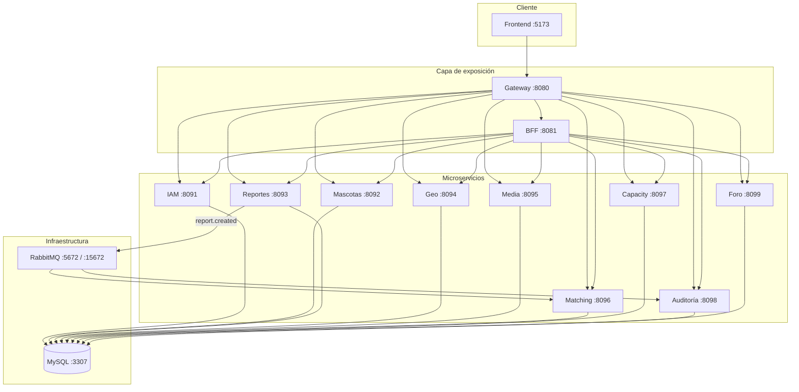

# Sanos y Salvos

Plataforma distribuida para **registro, reporte y coincidencia** de mascotas perdidas y encontradas. Arquitectura de **microservicios** con API Gateway, BFF, mensajería **RabbitMQ**, frontend web por roles y persistencia **MySQL** (patrón *database per service*).

---

## Tabla de contenidos

1. [Inicio rápido](#inicio-rápido)
2. [Estructura del repositorio](#estructura-del-repositorio)
3. [Arquitectura](#arquitectura)
4. [Stack tecnológico](#stack-tecnológico)
5. [Docker Compose](#docker-compose)
6. [RabbitMQ (mensajería)](#rabbitmq-mensajería)
7. [Frontend](#frontend)
8. [API y Swagger](#api-y-swagger)
9. [Credenciales de prueba](#credenciales-de-prueba)
10. [Flujos de uso](#flujos-de-uso)
11. [Endpoints por dominio](#endpoints-por-dominio)
12. [Modelo de datos](#modelo-de-datos)
13. [Desarrollo local](#desarrollo-local)
14. [Scripts y utilidades](#scripts-y-utilidades)
15. [Solución de problemas](#solución-de-problemas)
16. [Documentación adicional](#documentación-adicional)

---

## Inicio rápido

**Requisitos:** [Docker Desktop](https://www.docker.com/products/docker-desktop/) con Compose v2.

```bash
# Desde la raíz del proyecto
docker compose up --build -d
```

O en Windows: doble clic en **`encender-todo.bat`**.

| Recurso | URL |
|---------|-----|
| **Aplicación web** | http://localhost:5173 |
| **API Gateway** | http://localhost:8080 |
| **Swagger unificado** | http://localhost:8080/swagger-ui/index.html |
| **RabbitMQ Management** | http://localhost:15672 (`sanos` / `sanos_pwd`) |
| **MySQL (host)** | `localhost:3307` — usuario `sanos`, contraseña `sanos_pwd` |

**Login de prueba:** `ciudadano@sanosysalvos.cl` / `Ciudadano#2026` — Admin: `admin@sanosysalvos.cl` / `Admin#Sanos2026`

---

## Estructura del repositorio

```
Sanos--y--Salvos-main/
├── docker-compose.yml      # Stack completo (MySQL, RabbitMQ, 9 MS, BFF, gateway, frontend)
├── pom.xml                 # Agregador Maven (abrir raíz en IDE)
├── encender-todo.bat       # Levanta Docker en Windows
├── apagar-todo.bat         # Detiene contenedores
├── db/
│   ├── init.sql            # Crea db_* y permisos usuario sanos
│   └── schema-foro.sql     # Referencia tablas foro (opcional con XAMPP)
├── docs/
│   ├── RABBITMQ.md         # Eventos report.created
│   ├── XAMPP.md            # Desarrollo con Apache + MySQL local
│   └── FORO-TC.md          # Especificación técnica del foro
├── services/               # 9 microservicios Spring Boot (8091–8099)
│   ├── iam-service/
│   ├── pet-catalog-service/
│   ├── reports-service/    # Publica eventos RabbitMQ
│   ├── geo-intelligence-service/
│   ├── media-service/
│   ├── matching-service/   # Consumidor RabbitMQ
│   ├── capacity-service/
│   ├── audit-service/      # Consumidor RabbitMQ
│   └── forum-service/
├── gateway/                # JWT, CORS, proxy, Swagger agregado (:8080)
├── bff/                    # Agregación para dashboards (:8081)
├── frontend/               # HTML + JS (ver frontend/README.md)
├── scripts/                # run-xampp.ps1, fix-docker-mysql.ps1, etc.
└── uploads/                # Archivos media (local sin Docker)
```

---

## Arquitectura

### Vista general



### Principios de diseño

| Principio | Implementación |
|-----------|----------------|
| **Database per service** | Cada microservicio usa su esquema `db_*` (ver `db/init.sql`) |
| **API Gateway** | Punto único de entrada, validación JWT, rate limiting básico |
| **BFF** | Agregación resiliente para dashboard ciudadano/admin y mapa |
| **Mensajería asíncrona** | Al crear reporte → RabbitMQ → auditoría + matching |
| **Seguridad** | BCrypt en IAM; JWT HMAC-SHA (32+ caracteres) compartido IAM ↔ Gateway |
| **Documentación** | OpenAPI 3 en cada servicio; Swagger unificado en el gateway |
| **Datos de ejemplo** | *Seeding* al primer arranque en varios dominios |

---

## Stack tecnológico

| Capa | Tecnología |
|------|------------|
| Backend | Java 17, Spring Boot 3.3, Spring Data JPA |
| Mensajería | RabbitMQ 3.13, Spring AMQP |
| API | REST, Springdoc OpenAPI |
| Gateway / BFF | Spring Web, WebClient |
| Base de datos | MySQL 8.4 |
| Frontend | HTML5, CSS, JavaScript (vanilla), Leaflet + OpenStreetMap |
| Contenedores | Docker, Docker Compose, nginx (frontend) |

---

## Docker Compose

El archivo `docker-compose.yml` define **15 servicios** en la red `sanos_net`.

### Infraestructura

| Servicio | Contenedor | Puerto host | Notas |
|----------|------------|-------------|--------|
| `mysql` | `sanos-mysql` | **3307** → 3306 | Volumen `sanos_mysql_data`; init `db/init.sql` |
| `rabbitmq` | `sanos-rabbitmq` | **5672**, **15672** | Usuario `sanos` / `sanos_pwd` |

### Microservicios y capas

| Servicio Compose | Puerto | Base de datos | RabbitMQ |
|------------------|--------|---------------|----------|
| `iam-service` | 8091 | `db_iam` | — |
| `pet-catalog-service` | 8092 | `db_pets` | — |
| `reports-service` | 8093 | `db_reports` | **Productor** |
| `geo-intelligence-service` | 8094 | `db_geo` | — |
| `media-service` | 8095 | `db_media` | Volumen `sanos_media_uploads` |
| `matching-service` | 8096 | `db_matching` | **Consumidor** |
| `capacity-service` | 8097 | `db_capacity` | — |
| `audit-service` | 8098 | `db_audit` | **Consumidor** |
| `forum-service` | 8099 | `db_foro` | — |
| `bff` | 8081 | — | — |
| `gateway` | 8080 | — | — |
| `frontend` | 5173 → 80 | — | nginx + redirecciones `/citizen-*.html` |

### Comandos útiles

```bash
# Levantar / reconstruir
docker compose up --build -d

# Ver estado
docker compose ps

# Logs (todos o uno)
docker compose logs -f
docker compose logs -f reports-service

# Detener y eliminar contenedores (conserva volúmenes)
docker compose down

# Detener y borrar volúmenes (reset total de BD y uploads)
docker compose down -v
```

### Variables de entorno relevantes

| Variable | Dónde | Descripción |
|----------|-------|-------------|
| `SPRING_DATASOURCE_URL` | Cada MS | JDBC a `mysql:3306/db_*` dentro de la red Docker |
| `SPRING_RABBITMQ_*` | reports, audit, matching | Conexión al broker `rabbitmq` |
| `SANOS_MESSAGING_ENABLED` | reports | `false` desactiva publicación si no hay RabbitMQ |
| `SANOS_JWT_SECRET` | iam, gateway | Misma clave en ambos (mín. 32 caracteres) |
| `SANOS_MEDIA_UPLOAD_DIR` | media | `/data/uploads` en contenedor (volumen persistente) |

Copia `.env.example` si necesitas documentar variables para desarrollo híbrido (MySQL en host).

---

## RabbitMQ (mensajería)

Flujo académico implementado:

1. **POST** crear reporte → `reports-service` persiste en `db_reports`.
2. Publica evento **`report.created`** en exchange `sanos.events`.
3. **`audit-service`** escribe en `log_auditoria` (`CREATE_ASYNC`).
4. **`matching-service`** recibe el evento para el motor de coincidencias.

Detalle de colas, routing keys y demo para el profesor: **[docs/RABBITMQ.md](docs/RABBITMQ.md)**.

---

## Frontend

Estructura modular bajo `frontend/` (detalle en **[frontend/README.md](frontend/README.md)**):

```
frontend/
├── index.html, register.html
├── pages/citizen/     # Panel ciudadano
├── pages/admin/       # Panel administrador
├── assets/css/, assets/images/
└── src/
    ├── core/          # paths.js, config.js, shared.js
    ├── auth/, citizen/, admin/, layout/, ui/, profile/
```

| Pantalla | Ruta (Docker) |
|----------|----------------|
| Login | `/index.html` |
| Registro | `/register.html` |
| Reporte con mapa | `/pages/citizen/citizen-reporte.html` |
| Foro | `/pages/citizen/citizen-foro.html` (alias `/citizen-foro.html`) |
| Perfil ciudadano | `/pages/citizen/citizen-perfil.html` |
| Resumen admin | `/pages/admin/admin-resumen.html` |

El frontend llama al **gateway** (`http://localhost:8080` en Docker). Leaflet usa CDN (`unpkg.com`) y tiles de OpenStreetMap.

---

## API y Swagger

**Recomendado:** Swagger unificado en el gateway.

- URL: http://localhost:8080/swagger-ui/index.html
- Selector superior para cambiar entre APIs (IAM, mascotas, reportes, …, BFF, foro).
- Rutas internas de documentación: `/openapi/{servicio}/v3/api-docs`
- Autenticación: `POST /api/iam/login` → copiar token → **Authorize** (Bearer JWT).

**Swagger directo por puerto** (sin gateway): `http://localhost:8091/swagger-ui/index.html` (IAM), `8092` (mascotas), … `8099` (foro), `8081` (BFF).

Cada controlador usa anotaciones OpenAPI (`@Tag`, `@Operation`); entidades y DTOs incluyen `@Schema` con mapeo a tablas SQL.

---

## Credenciales de prueba

| Rol | Email | Contraseña |
|-----|-------|------------|
| Administrador | `admin@sanosysalvos.cl` | `Admin#Sanos2026` |
| Ciudadano | `ciudadano@sanosysalvos.cl` | `Ciudadano#2026` |

MySQL (Docker): usuario **`sanos`**, contraseña **`sanos_pwd`**, puerto host **3307**.

---

## Flujos de uso

### Ciudadano

1. Registrarse en `register.html` o `POST /api/iam/register`.
2. Iniciar sesión → JWT con rol `CIUDADANO`.
3. Registrar mascota y crear **reporte** (mapa + foto opcional).
4. El reporte dispara evento RabbitMQ (auditoría asíncrona).
5. Consultar foro, perfil y actividad desde el panel lateral.

### Administrador

1. Login con cuenta admin → dashboard en `pages/admin/`.
2. Revisar salud de microservicios, KPIs, usuarios IAM, reportes, capacity.
3. Mapa de zonas de riesgo (geo), matching y **logs de auditoría** (incluye entradas `CREATE_ASYNC` vía RabbitMQ).
4. Ejecutar motor de coincidencias: `POST /api/matching/run`.

### Autenticación API

Enviar en todas las rutas protegidas:

```http
Authorization: Bearer <token>
```

Excepciones públicas: `/api/*/health`, login y registro.

---

## Endpoints por dominio

Prefijo común vía gateway: `http://localhost:8080`

| Dominio | Rutas principales |
|---------|-------------------|
| **IAM** | `POST /api/iam/register`, `POST /api/iam/login`, `GET /api/iam/users` |
| **Mascotas** | `GET/POST /api/pets`, `GET /api/pets/{id}`, `GET /api/pets/owner/{ownerId}` |
| **Reportes** | `GET/POST /api/reports`, `PATCH /api/reports/{id}/status`, `GET /api/reports/pet/{petId}` |
| **Geo** | `GET/POST /api/zones`, `GET /api/zones/risk-summary` |
| **Media** | `GET/POST /api/media`, `GET /api/media/pet/{petId}` |
| **Matching** | `GET /api/matching`, `POST /api/matching/run` |
| **Capacity** | `GET/POST /api/capacity`, `GET /api/capacity/summary` |
| **Auditoría** | `GET /api/audit`, `GET /api/audit/entity/{entity}` |
| **Foro** | `GET/POST /api/forum/threads`, `POST /api/forum/threads/{id}/posts` |
| **BFF** | `GET /api/bff/dashboard`, `GET /api/bff/map`, `GET /api/bff/pet-overview/{petId}` |

Todos los servicios exponen `GET /api/<dominio>/health` para el panel de estado del admin.

---

## Modelo de datos

Patrón **3FN**, **19 tablas** repartidas en **9 bases** `db_*`:

| Base | Tablas (dominio) |
|------|------------------|
| `db_iam` | `usuarios`, `credenciales`, `contactos_usuario` |
| `db_pets` | `mascotas`, `caracteristicas_fisicas`, `vinculos_mascotas` |
| `db_reports` | `reportes_eventos`, `detalles_reporte` |
| `db_geo` | `zonas_incidencia`, `coordenadas_reporte` |
| `db_media` | `fotografias_mascotas` |
| `db_matching` | `coincidencias_ia`, `desglose_similitud` |
| `db_capacity` | `equipos_colaboracion`, `asignacion_capacidad` |
| `db_audit` | `log_auditoria`, `notificaciones_sistema` |
| `db_foro` | `hilos_foro`, `mensajes_foro` |

Hibernate (`ddl-auto: update`) crea y actualiza tablas al arrancar cada servicio. Script de inicialización: **`db/init.sql`**.

---

## Desarrollo local

### Opción A — Solo infra en Docker, apps en IDE

```bash
docker compose up mysql rabbitmq -d
```

Importar **`pom.xml` raíz** en IntelliJ / VS Code y ejecutar cada `*Application` (puertos 8091–8099, BFF 8081, gateway 8080). Ver `.vscode/launch.json`.

Variables locales típicas:

- MySQL: `localhost:3307` (Docker) o `3306` (XAMPP)
- RabbitMQ: `localhost:5672`, usuario `sanos`

### Opción B — XAMPP

Guía paso a paso: **[docs/XAMPP.md](docs/XAMPP.md)**

```powershell
.\scripts\run-xampp.ps1 -Service forum
```

Frontend estático:

```bash
npx http-server frontend -p 5173
```

### Opción C — Stack completo Docker

Ver [Inicio rápido](#inicio-rápido) y [Docker Compose](#docker-compose).

---

## Scripts y utilidades

| Script | Función |
|--------|---------|
| `encender-todo.bat` | `docker compose up --build -d` + resumen de URLs |
| `apagar-todo.bat` | `docker compose down` |
| `scripts/run-xampp.ps1` | Arranca un microservicio contra MySQL XAMPP |
| `scripts/fix-docker-mysql.ps1` | Repara permisos `db_foro` en volúmenes MySQL antiguos |

Compilar todos los módulos desde la raíz:

```bash
mvn clean install -DskipTests
```

---

## Solución de problemas

| Síntoma | Qué revisar |
|---------|-------------|
| Mapa en blanco | Acceso a `unpkg.com` y `tile.openstreetmap.org` |
| `Access denied` a `db_foro` | Ejecutar `scripts/fix-docker-mysql.ps1` y reiniciar `forum-service` |
| Puerto 8099 ocupado | No ejecutar foro en IDE si Docker ya lo usa |
| JWT inválido | Mismo `SANOS_JWT_SECRET` en IAM y gateway |
| RabbitMQ sin mensajes | Que `audit-service` y `matching-service` estén arriba; revisar http://localhost:15672 |
| BFF con servicios DOWN | El BFF devuelve datos parciales; revisar `docker compose logs` del MS afectado |
| Datos corruptos / permisos viejos | `docker compose down -v` (borra volúmenes) y volver a `up --build` |

---

## Documentación adicional

| Documento | Contenido |
|-----------|-----------|
| [docs/RABBITMQ.md](docs/RABBITMQ.md) | Topología, colas, demo académica |
| [docs/XAMPP.md](docs/XAMPP.md) | phpMyAdmin, puertos, Maven local |
| [docs/FORO-TC.md](docs/FORO-TC.md) | Casos de uso y API del foro |
| [frontend/README.md](frontend/README.md) | Carpetas, rutas y scripts por página |

---

## Licencia y autoría

Proyecto académico — arquitectura de microservicios según informe del curso. Para contribuir o desplegar en otro entorno, adaptar `docker-compose.yml` y secretos (`SANOS_JWT_SECRET`, contraseñas MySQL/RabbitMQ) antes de producción.
