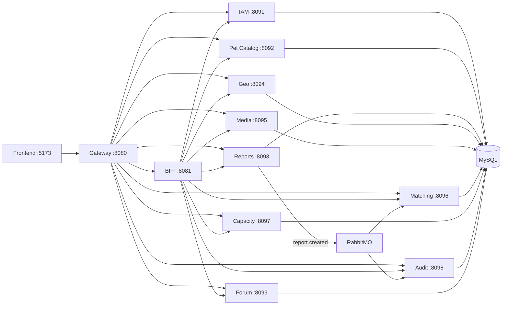

# Sanos y Salvos

Plataforma distribuida para **registro, reporte, geolocalización, coordinación comunitaria y coincidencia de mascotas** perdidas/encontradas.

El proyecto está implementado con arquitectura de **microservicios Spring Boot**, **API Gateway**, **BFF**, **RabbitMQ**, **MySQL** y frontend web modular.

---

## Tabla de contenidos

1. [Resumen ejecutivo](#resumen-ejecutivo)
2. [Inicio rápido](#inicio-rapido)
3. [Arquitectura del sistema](#arquitectura-del-sistema)
4. [Estructura del repositorio](#estructura-del-repositorio)
5. [Microservicios y responsabilidades](#microservicios-y-responsabilidades)
6. [Puertos, URLs y credenciales](#puertos-urls-y-credenciales)
7. [Infraestructura Docker](#infraestructura-docker)
8. [Mensajería RabbitMQ](#mensajeria-rabbitmq)
9. [Frontend](#frontend)
10. [API y Swagger](#api-y-swagger)
11. [Modelo de datos](#modelo-de-datos)
12. [Ejecución por escenarios](#ejecucion-por-escenarios)
13. [Pruebas y calidad](#pruebas-y-calidad)
14. [Scripts útiles](#scripts-utiles)
15. [Operación diaria](#operacion-diaria)
16. [Troubleshooting](#troubleshooting)
17. [Roadmap técnico sugerido](#roadmap-tecnico-sugerido)
18. [Documentación adicional](#documentacion-adicional)

---

## Resumen ejecutivo

- **Dominio:** mascotas perdidas/encontradas con trazabilidad y colaboración ciudadana.
- **Patrón de persistencia:** `database-per-service` (`db_iam`, `db_pets`, `db_reports`, etc.).
- **Entrada única:** `gateway` en `:8080`.
- **Agregación de datos para UI:** `bff` en `:8081`.
- **Asincronía académica:** evento `report.created` en RabbitMQ.
- **Frontend:** vistas separadas por rol (ciudadano/admin) con navegación lateral y mapa.

---

## Inicio rapido

### Requisitos

- Docker Desktop + Compose v2.
- Java 17 y Maven 3.9+ (solo para correr fuera de Docker).

### Levantar todo

```bash
docker compose up --build -d
```

En Windows también puedes usar:

- `encender-todo.bat`

### Verificación rápida

```bash
docker compose ps
docker compose logs -f gateway
```

---

## Arquitectura del sistema



### Principios aplicados

- **Separación por dominio:** cada microservicio tiene contexto y datos propios.
- **Resiliencia en frontend:** BFF entrega respuesta parcial si algún backend cae.
- **Trazabilidad:** auditoría y eventos de negocio asíncronos.
- **Escalabilidad:** componentes desacoplados vía HTTP + mensajería.

---

## Estructura del repositorio

```text
Sanos--y--Salvos-main/
├── bff/
├── gateway/
├── services/
│   ├── iam-service/
│   ├── pet-catalog-service/
│   ├── reports-service/
│   ├── geo-intelligence-service/
│   ├── media-service/
│   ├── matching-service/
│   ├── capacity-service/
│   ├── audit-service/
│   └── forum-service/
├── frontend/
├── db/
├── docs/
├── scripts/
├── docker-compose.yml
├── pom.xml
├── encender-todo.bat
└── apagar-todo.bat
```

### Carpetas clave

- `services/`: microservicios Java.
- `frontend/`: HTML/CSS/JS modular.
- `db/`: SQL de bootstrap y esquema de foro.
- `docs/`: documentación técnica específica.
- `scripts/`: automatizaciones de ejecución local y soporte.

---

## Microservicios y responsabilidades

| Servicio | Puerto | Responsabilidad |
|---|---:|---|
| `iam-service` | 8091 | Registro, login, JWT, perfil y roles |
| `pet-catalog-service` | 8092 | Alta y consulta de mascotas |
| `reports-service` | 8093 | Reportes de pérdida/hallazgo + publicación evento |
| `geo-intelligence-service` | 8094 | Zonas de riesgo y coordenadas |
| `media-service` | 8095 | Evidencias fotográficas y metadatos |
| `matching-service` | 8096 | Motor de coincidencias |
| `capacity-service` | 8097 | Equipos, horas y capacidad de respuesta |
| `audit-service` | 8098 | Logs de auditoría y consumo de eventos |
| `forum-service` | 8099 | Hilos y respuestas comunitarias |
| `bff` | 8081 | Agregación para dashboard/mapa |
| `gateway` | 8080 | API edge, seguridad y Swagger unificado |

---

## Puertos, URLs y credenciales

### URLs principales

| Recurso | URL |
|---|---|
| Frontend | http://localhost:5173 |
| Gateway | http://localhost:8080 |
| BFF | http://localhost:8081 |
| Swagger unificado | http://localhost:8080/swagger-ui/index.html |
| RabbitMQ UI | http://localhost:15672 |
| MySQL host | `localhost:3307` |

### Credenciales de prueba

| Tipo | Usuario | Password |
|---|---|---|
| Admin | `admin@sanosysalvos.cl` | `Admin#Sanos2026` |
| Ciudadano | `ciudadano@sanosysalvos.cl` | `Ciudadano#2026` |
| RabbitMQ | `sanos` | `sanos_pwd` |
| MySQL | `sanos` | `sanos_pwd` |

---

## Infraestructura Docker

`docker-compose.yml` levanta:

- `mysql` con volumen persistente `sanos_mysql_data`.
- `rabbitmq` con panel de administración.
- 9 microservicios + `bff` + `gateway` + `frontend`.
- volumen `sanos_media_uploads` para archivos de media.

### Comandos frecuentes

```bash
docker compose up --build -d
docker compose ps
docker compose logs -f
docker compose logs -f reports-service
docker compose down
docker compose down -v
```

### Variables relevantes

| Variable | Uso |
|---|---|
| `SPRING_DATASOURCE_URL` | conexión MySQL por servicio |
| `SPRING_RABBITMQ_HOST` | broker en Docker (`rabbitmq`) |
| `SPRING_RABBITMQ_USERNAME` / `PASSWORD` | autenticación AMQP |
| `SANOS_MESSAGING_ENABLED` | habilita publicación asíncrona en reports |
| `SANOS_JWT_SECRET` | clave compartida IAM/Gateway |
| `SANOS_MEDIA_UPLOAD_DIR` | ruta de almacenamiento en media-service |

---

## Mensajeria RabbitMQ

### Evento de negocio implementado

- **Exchange:** `sanos.events` (topic)
- **Routing key:** `report.created`
- **Productor:** `reports-service`
- **Consumidores:** `audit-service`, `matching-service`

### Flujo

1. Se crea reporte en `reports-service`.
2. Se publica `ReportCreatedEvent`.
3. `audit-service` persiste log `CREATE_ASYNC`.
4. `matching-service` recibe trigger para procesar coincidencias.

Ver detalle técnico y demo: `docs/RABBITMQ.md`.

---

## Frontend

Estructura principal:

```text
frontend/
├── index.html
├── register.html
├── pages/
│   ├── citizen/
│   └── admin/
├── assets/
│   ├── css/
│   └── images/
└── src/
    ├── core/
    ├── auth/
    ├── citizen/
    ├── admin/
    ├── layout/
    ├── profile/
    └── ui/
```

### Rutas destacadas

- `/index.html`
- `/register.html`
- `/pages/citizen/citizen-reporte.html`
- `/pages/citizen/citizen-foro.html`
- `/pages/admin/admin-resumen.html`

`frontend/nginx.conf` mantiene redirecciones cortas de compatibilidad (`/citizen-*.html` y `/admin-*.html`).

---

## API y Swagger

### Swagger recomendado (gateway)

- `http://localhost:8080/swagger-ui/index.html`

### Swagger por servicio

- IAM: `:8091`
- Pets: `:8092`
- Reports: `:8093`
- Geo: `:8094`
- Media: `:8095`
- Matching: `:8096`
- Capacity: `:8097`
- Audit: `:8098`
- Forum: `:8099`
- BFF: `:8081`

### Autenticación

1. `POST /api/iam/login`
2. Copiar token JWT
3. Usar `Authorization: Bearer <token>`

---

## Modelo de datos

Se aplica 3FN con esquema por dominio:

| Base | Tablas principales |
|---|---|
| `db_iam` | `usuarios`, `credenciales`, `contactos_usuario` |
| `db_pets` | `mascotas`, `caracteristicas_fisicas`, `vinculos_mascotas` |
| `db_reports` | `reportes_eventos`, `detalles_reporte` |
| `db_geo` | `zonas_incidencia`, `coordenadas_reporte` |
| `db_media` | `fotografias_mascotas` |
| `db_matching` | `coincidencias_ia`, `desglose_similitud` |
| `db_capacity` | `equipos_colaboracion`, `asignacion_capacidad` |
| `db_audit` | `log_auditoria`, `notificaciones_sistema` |
| `db_foro` | `hilos_foro`, `mensajes_foro` |

`db/init.sql` crea bases/permisos y Hibernate (`ddl-auto=update`) completa tablas.

---

## Ejecucion por escenarios

### Escenario A: Todo en Docker

```bash
docker compose up --build -d
```

### Escenario B: Infra en Docker + servicios en IDE

```bash
docker compose up mysql rabbitmq -d
```

Luego ejecutar `*Application` desde IDE.

### Escenario C: XAMPP local

Ver `docs/XAMPP.md` y script:

```powershell
.\scripts\run-xampp.ps1 -Service forum
```

---

## Pruebas y calidad

El proyecto incluye pruebas unitarias en varios módulos (gateway, bff, iam, reports, forum, pet-catalog, geo, media, matching, audit y capacity).

### Ejecutar todo

```bash
mvn test -DskipITs
```

### Ejecutar por módulo

```bash
mvn -pl services/iam-service test
mvn -pl services/reports-service test
mvn -pl services/forum-service test
mvn -pl services/capacity-service test
mvn -pl services/matching-service,services/media-service,services/audit-service,services/geo-intelligence-service test
```

### Objetivo académico sugerido

- Mantener pruebas verdes en CI local antes de commit.
- Aumentar cobertura útil en capas `service` y `controller`.
- Añadir JaCoCo si se requiere porcentaje formal de cobertura.

---

## Scripts utiles

| Script | Propósito |
|---|---|
| `encender-todo.bat` | levanta stack completo y muestra endpoints |
| `apagar-todo.bat` | detiene stack Docker |
| `arrancar-foro.bat` | arranque rápido de foro |
| `scripts/run-xampp.ps1` | ejecutar servicios contra XAMPP |
| `scripts/fix-docker-mysql.ps1` | corregir grants/permisos de MySQL |

---

## Operacion diaria

### Logs y diagnóstico

```bash
docker compose logs -f gateway
docker compose logs -f reports-service audit-service matching-service
docker compose logs -f forum-service
```

### Reinicio parcial

```bash
docker compose restart reports-service
docker compose restart forum-service
```

### Estado de contenedores

```bash
docker compose ps
```

---

## Troubleshooting

| Problema | Acción recomendada |
|---|---|
| No inicia `forum-service` por permisos | ejecutar `scripts/fix-docker-mysql.ps1` |
| Error JWT en gateway | revisar `SANOS_JWT_SECRET` en IAM y gateway |
| No aparecen mensajes RabbitMQ | verificar `reports`, `audit`, `matching` y cola en `:15672` |
| Puerto ocupado (8099, 8094, etc.) | detener proceso o contenedor previo |
| Front no resuelve rutas cortas | validar `frontend/nginx.conf` y rebuild frontend |
| Datos inconsistentes | `docker compose down -v` y levantar de nuevo |
| Tests no aparecen en un módulo | refrescar Test Explorer y correr `mvn -pl <modulo> test` |

---

## Roadmap tecnico sugerido

- Integrar JaCoCo con reporte agregado por reactor Maven.
- Añadir pruebas de contrato API (MockMvc) por microservicio.
- Añadir pruebas de integración con Testcontainers para MySQL y RabbitMQ.
- Definir perfil `ci` con checks de formato/lint/test.
- Incorporar healthchecks funcionales de negocio en BFF admin dashboard.

---

## Documentacion adicional

| Documento | Contenido |
|---|---|
| `docs/RABBITMQ.md` | topología de eventos y validación demo |
| `docs/XAMPP.md` | guía de ejecución local con Apache/MySQL |
| `docs/FORO-TC.md` | especificación técnica del módulo foro |
| `frontend/README.md` | estructura frontend, rutas y carga de scripts |

---

## Nota final

Proyecto académico con foco en arquitectura distribuida y trazabilidad.

Para uso fuera de entorno local, antes de producción debes:

- mover secretos a un gestor seguro,
- endurecer CORS y autenticación,
- configurar observabilidad centralizada,
- y separar configuración por ambiente (`dev`, `staging`, `prod`).
